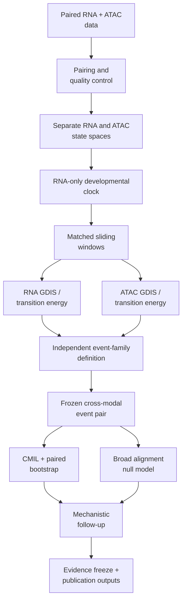

# GDIS-Multiome

**A reproducible computational framework for resolving cross-modal dynamical state-transition architecture in paired single-cell multiomics.**

[](https://www.python.org/)
[](#environment)
[](#reproducing-the-study)
[](#datasets)
[](LICENSE_PENDING.md)

## Associated paper

**GDIS-Multiome: A Dynamical Instability Framework for Resolving Cross-Modal State-Transition Architecture in Paired Single-Cell Multiomics**

**Authors:** Hamid Ismail, Ahmed Harb, Basem William, and Marwan Bikdash

> Citation details will be updated after the article receives its final bibliographic record.

---

## Overview

GDIS-Multiome extends the **Generalized Dynamical Instability Score (GDIS)** to paired single-cell RNA and chromatin-accessibility data. The framework asks where molecular instability emerges along a developmental trajectory, whether that instability is sustained or localized, and whether reproducible modality-specific events exhibit cross-modal temporal ordering.

The workflow is designed to reduce circularity: RNA and ATAC are represented independently, the common developmental clock is constructed from RNA only, identical paired cells are evaluated in matched pseudotime windows, event families are frozen independently within each modality, and directional timing is tested only after event identity has been fixed.



### Cross-modal instability lag

For a frozen RNA event at pseudotime $\tau_{\mathrm{RNA}}$ and ATAC event at $\tau_{\mathrm{ATAC}}$:

```math
\mathrm{CMIL} = \tau_{\mathrm{RNA}} - \tau_{\mathrm{ATAC}}
```

Positive CMIL indicates an earlier ATAC event, values near zero indicate approximate synchrony, and negative CMIL indicates an earlier RNA event.

## Key design principles

- **Same cells, separate modalities.** RNA and ATAC remain in modality-specific state spaces.
- **RNA-only common clock.** ATAC does not define the pseudotime coordinate against which its timing is evaluated.
- **Matched windows.** RNA and ATAC values are calculated from identical cells in each window.
- **Prospective event freezing.** Event families are selected independently before cross-modal direction is examined.
- **Localized timing is separated from broad alignment.**
- **Negative results are preserved.** A failed trajectory-suitability gate, non-significant broad alignment, or null motif result remains a valid scientific outcome.
- **Frozen implementation.** Manuscript replication requires `pygdis==1.0.0`.

## Datasets

| GEO accession | Biological system | Study role | Analysis population | Final role |
|---|---|---|---:|---|
| **GSE275562** | Mouse pancreatic endocrinogenesis, 10x Multiome | Discovery | 22,604 paired total; 8,868 analyzed | Robust RNA clock; modality-specific/multimodal instability |
| **GSE205117** | Mouse early organogenesis, 10x Multiome | Trajectory-suitability control | 5,344 primary WT arm; 4,859 trajectory subset | Rejected before GDIS timing because the required continuous biological topology was not supported |
| **GSE140203** | Mouse skin / hair follicle, SHARE-seq | Independent external validation | 34,774 paired total; 5,050 TAC-1 → TAC-2 → IRS | Localized ATAC-earlier transition-energy event supported |

All datasets are public and are acquired by the canonical scripts. See [`docs/DATASETS.md`](docs/DATASETS.md).

## Repository structure

```text
GDIS-Multiome/
├── README.md
├── CITATION.cff
├── CHANGELOG.md
├── CONTRIBUTING.md
├── LICENSE_PENDING.md
├── .gitignore
├── run_pipeline.py
├── run_pipeline.sh
├── validate_pipeline_package.py
├── scripts/
│   ├── 00_preflight.py
│   ├── 01 ... 12        # GSE275562 discovery
│   ├── 13 ... 21        # GSE205117 trajectory-suitability branch
│   ├── 22               # canonical SHARE-seq acquisition
│   ├── 24 ... 37        # SHARE-seq external validation
│   ├── 39               # frozen SHARE-seq publication output
│   └── 40 ... 48        # manuscript figures/tables
├── config/
│   ├── environment.yml
│   └── requirements.txt
├── data/                 # generated/downloaded data; not committed
├── logs/                 # execution logs; not committed
├── checksums/
└── docs/
    ├── REPRODUCE.md
    ├── PIPELINE.md
    ├── DATASETS.md
    ├── REFERENCE_RESULTS.md
    ├── ROADMAP.md
    ├── TROUBLESHOOTING.md
    └── ...
```

The numbering gaps at **23** and **38** are intentional because superseded development scripts were removed from the canonical workflow.

## Environment

### Recommended: Conda or Mamba

```bash
git clone <YOUR-GITHUB-REPOSITORY-URL>
cd GDIS-Multiome

conda env create -f config/environment.yml
conda activate gdis_multiome
```

With Mamba:

```bash
mamba env create -f config/environment.yml
conda activate gdis_multiome
```

### Alternative: pip

```bash
python -m venv .venv
source .venv/bin/activate
python -m pip install --upgrade pip
python -m pip install -r config/requirements.txt
```

On Windows PowerShell:

```powershell
.venv\Scripts\Activate.ps1
```

### Validate the installation

```bash
python validate_pipeline_package.py
python scripts/00_preflight.py
```

## Reproducing the study

Run commands from the repository root.

### Full analysis

```bash
python run_pipeline.py --branch all
```

or:

```bash
./run_pipeline.sh --branch all
```

### Manuscript-core analysis

```bash
python run_pipeline.py --branch core
```

### Individual branches

```bash
python run_pipeline.py --branch discovery
python run_pipeline.py --branch gse205117
python run_pipeline.py --branch shareseq
```

Every master-runner step writes stdout/stderr to `logs/`. See **[`docs/REPRODUCE.md`](docs/REPRODUCE.md)** for complete instructions.

## Computational and storage considerations

The complete analysis downloads public GEO and reference resources. The GSE205117 branch includes a raw archive of approximately **32.5 GB**. A full run should have **at least ~80 GiB free disk space**.

Runtime depends on network bandwidth, filesystem throughput, CPU resources, and exhaustive barcode/fragment scans. The full runner intentionally uses the scientifically canonical exhaustive checks rather than shortened diagnostic scans.

## Reference scientific checkpoints

A successful replication should recover the qualitative and numerical checkpoints in [`docs/REFERENCE_RESULTS.md`](docs/REFERENCE_RESULTS.md), including:

- discovery: robust RNA-derived clock but no robust universal ATAC-before-RNA lead;
- GSE205117: trajectory-suitability rejection before GDIS timing;
- SHARE-seq primary localized events near ATAC **0.1235** and RNA **0.1541**;
- observed CMIL **0.0306** pseudotime units;
- bootstrap paired recovery **84.4%**;
- bootstrap median CMIL **0.0371**, 95% CI **0.0111–0.0528**;
- broad alignment classified as limited/no evidence under the prespecified primary null;
- **0 of 326** eligible TF motifs passing all enrichment criteria.

These values are replication checkpoints, not targets for parameter tuning.

## Publication outputs

Publication-only scripts consume frozen upstream evidence and do not redefine the inferential targets.

```text
39_phase_f23b_shareseq_irs_publication_figure_revision.py
40_phase_f24_discovery_publication_figure.py
41_supplementary_figure_s1_discovery_diagnostics.py
42_supplementary_figure_s2_discovery_alignment_null.py
43_supplementary_figure_s3_gse205117_trajectory_suitability.py
44_supplementary_figure_s4_tf_motif_enrichment.py
45_main_figure_5_exact_circular_shift_null.py
46_supplementary_figure_s5_shareseq_sustained_architecture.py
47_supplementary_table_s4_shareseq_event_family_selection.py
48_supplementary_table_s5_shareseq_branch_selection_qc.py
```

See [`docs/PIPELINE.md`](docs/PIPELINE.md) and [`scripts/README.md`](scripts/README.md).

## Reproducibility safeguards

1. ATAC does not contribute to the common developmental clock.
2. RNA and ATAC state spaces remain separate.
3. Identical paired cells and matched sliding windows are used across modalities.
4. Event families are frozen before directional comparison.
5. Bootstrap resampling preserves paired-cell identity.
6. Broad alignment uses a dependence-preserving primary null.
7. Mechanistic annotation occurs only after timing inference is frozen.
8. Negative and limited results are not replaced by post hoc alternatives.

## Documentation

| Document | Purpose |
|---|---|
| [`docs/REPRODUCE.md`](docs/REPRODUCE.md) | Complete replication guide |
| [`docs/PIPELINE.md`](docs/PIPELINE.md) | Scientific and computational workflow |
| [`docs/DATASETS.md`](docs/DATASETS.md) | Dataset provenance, roles, and cell counts |
| [`docs/REFERENCE_RESULTS.md`](docs/REFERENCE_RESULTS.md) | Frozen replication checkpoints |
| [`docs/ROADMAP.md`](docs/ROADMAP.md) | Planned extensions |
| [`docs/TROUBLESHOOTING.md`](docs/TROUBLESHOOTING.md) | Installation/data/runtime issues |
| [`docs/SCIENTIFIC_BRANCHES.md`](docs/SCIENTIFIC_BRANCHES.md) | Scientific role of each branch |
| [`docs/canonical_pipeline_manifest.tsv`](docs/canonical_pipeline_manifest.tsv) | Machine-readable stage manifest |
| [`docs/EXCLUDED_SCRIPTS.md`](docs/EXCLUDED_SCRIPTS.md) | Audit trail for superseded scripts |

## Roadmap

Planned directions include broader paired-multiome benchmarking, branch-aware analysis, additional paired molecular modalities, stronger downstream regulatory integration, direct chronological/perturbation-time analyses, and a simplified reusable interface.

See [`docs/ROADMAP.md`](docs/ROADMAP.md).

## Contributing

Issues and pull requests are welcome for reproducibility bugs, documentation improvements, portability fixes, and scientifically justified extensions. Changes that alter frozen manuscript thresholds or event definitions should remain clearly separated from exact manuscript replication.

See [`CONTRIBUTING.md`](CONTRIBUTING.md).

## Citation

If you use this repository, please cite the associated paper:

> Hamid Ismail, Ahmed Harb, Basem William, and Marwan Bikdash. **GDIS-Multiome: A Dynamical Instability Framework for Resolving Cross-Modal State-Transition Architecture in Paired Single-Cell Multiomics.** 2026. Final journal/DOI information will be added after publication.

Machine-readable citation metadata are provided in [`CITATION.cff`](CITATION.cff).

## Authors

- **Hamid Ismail**
- **Ahmed Harb**
- **Basem William**
- **Marwan Bikdash**

## License

A software license has **not yet been selected** for the public release. See [`LICENSE_PENDING.md`](LICENSE_PENDING.md). Choose the final license before making the repository public.
