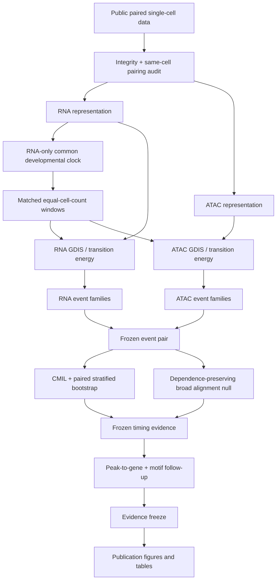

# Pipeline overview

GDIS-Multiome separates biological ordering from modality-specific dynamical analysis so that cross-modal timing is treated as an outcome rather than built into the trajectory.

## Branches

### GSE275562 — discovery
Scripts 01–12 establish the discovery trajectory, GDIS structure, frozen comparison, bootstrap diagnostics, and broad-alignment null. Scripts 40–42 create publication outputs from frozen evidence.

### GSE205117 — trajectory-suitability control
Scripts 13–21 reconstruct the paired data and test whether a biologically defensible continuous common trajectory exists. It does not, so the branch ends before GDIS timing. Script 43 summarizes that frozen suitability result.

### GSE140203 — SHARE-seq validation
Scripts 22 and 24–37 reproduce acquisition, pairing, representation construction, RNA-only trajectory, GDIS/transition-energy analysis, event freezing, bootstrap inference, broad-alignment testing, molecular feature extraction, annotation, motif analysis, and final evidence freeze. Scripts 39 and 44–48 generate manuscript outputs.

## Safeguards

- ATAC is excluded from common-clock construction.
- RNA and ATAC remain in separate state spaces.
- Matched windows contain identical paired cells.
- Event families are selected independently before direction is evaluated.
- Bootstrap samples preserve paired-cell identity.
- Localized timing and broad alignment are separate hypotheses.
- Mechanistic annotation occurs after timing inference is frozen.
- Negative and limited results remain part of the canonical record.

See `canonical_pipeline_manifest.tsv` for the machine-readable script map.
